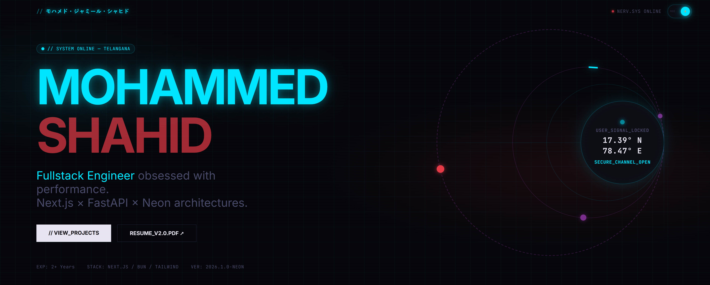

# Portfolio 2026 | Minimalist System Architecture

> A high-performance, engineering-first portfolio built with **Next.js 16**, **Bun**, and **Tailwind CSS v4**. Designed with an "Evangelion / TVA" aesthetic, featuring a sticky horizontal scroll, tri-lingual system boot sequence, and raw semantic HTML.



## Tech Stack

- **Runtime:** [Bun](https://bun.sh) (Blazing fast package manager & runtime)
- **Framework:** [Next.js 16](https://nextjs.org) (App Router)
- **Styling:** [Tailwind CSS v4](https://tailwindcss.com) (CSS Variables, No Config)
- **Animation:** [Framer Motion](https://www.framer.com/motion/) (Complex orchestrations)
- **Icons:** [React Icons](https://react-icons.github.io/react-icons/) (Simple Icons set)

## Features

- **System Boot Loader:** A cinematic, tri-lingual (EN/JP/AR) loading sequence that "boots up" the portfolio.
- **Sticky Horizontal Scroll:** A unique project showcase that transforms vertical scrolling into horizontal panning using `framer-motion`.
- **Ghost Tech Marquee:** An infinite scrolling loop of tech stack logos that light up on hover.
- **Dynamic Geolocation:** A "Head-Up Display" (HUD) in the Hero section that detects the user's real coordinates or falls back to base location.
- **Bilingual Header:** A name glitch effect that cycles between English, Japanese (Katakana), and Arabic.
- **Theme System:**
  - **Light Mode:** "TVA Bureaucracy" (Warm Paper / Ink / Amber)
  - **Dark Mode:** "Unit-02 Code" (Deep Gunmetal / Signal White / Orange)

## Getting Started

This project uses **Bun**. Ensure you have it installed.

```bash
# Install dependencies
bun install

# Run the development server
bun dev
```

Open [http://localhost:3000](http://localhost:3000) with your browser to see the result.

## 📂 Project Structure

```bash
src/
├── app/
│   ├── globals.css       # Tailwind v4 Theme Variables (Evangelion/TVA colors)
│   ├── layout.tsx        # Root layout with Header/Theme Provider
│   └── page.tsx          # Main entry (Loader -> Hero -> Marquee -> Projects)
├── components/
│   ├── Hero.tsx          # Multi-layer orbital HUD & Introduction
│   ├── History.tsx       # Vertical timeline of experience
│   ├── Preloader.tsx     # The "System Boot" loading screen
│   ├── Projects.tsx      # Sticky Horizontal Scroll section
│   └── TechMarquee.tsx   # Infinite logo loop
├── utils/
│   └── constants.ts      # SINGLE SOURCE OF TRUTH (Update content here)

```

## 🎨 Customization

### 1. Update Content

Go to `src/utils/constants.ts`. You can change your **Name**, **Links**, **Projects**, and **Experience** there. The site will automatically update.

```typescript
export const DATA = {
  name: "Mohammed Jameel Shahid",
  location: "Telangana, India",
  // ...
};
```

### 2. Change Colors

Go to `src/app/globals.css`. The entire theme is controlled by CSS variables compatible with Tailwind v4.

```css
/* Dark Mode (Evangelion Unit-02) */
.dark {
  --background: #0a0a0b;
  --primary: #f97316; /* Change this hex to swap the accent color */
}
```

## 📄 License

MIT © [Mohammed Jameel Shahid](https://github.com/Shahid0324-GIT)
